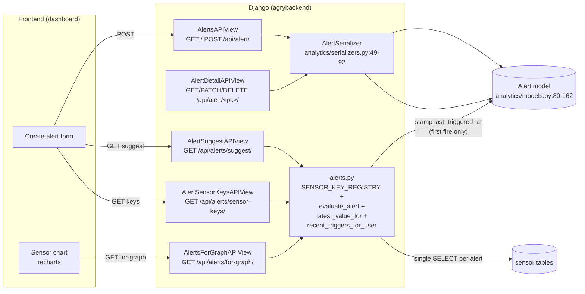
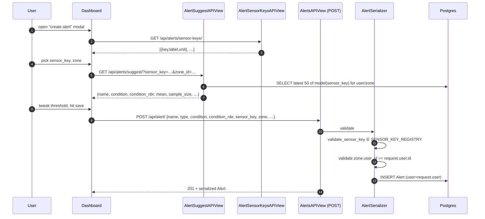
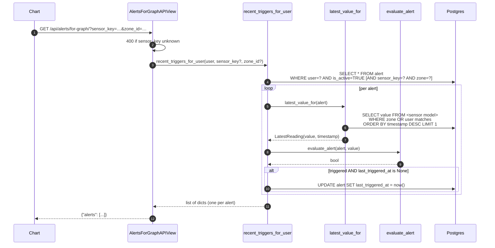
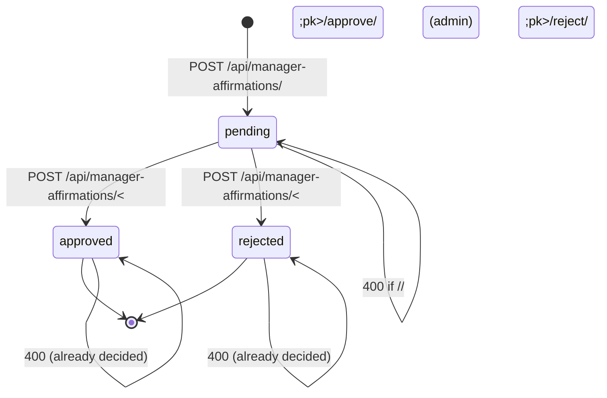

# Alerts — End-to-End Flow

How an alert rule is created, evaluated, and surfaced to the user.
Includes the **manager-affirmation** workflow because it shares the
admin tree but is intentionally NOT alert-driven. Last verified
2026-05-20.

## TL;DR

```
User creates alert  ─▶  Alert row (rule + state in one model)
                              │
                              │ stored
                              ▼
                          Postgres
                              ▲
                              │ on every chart load:
                              │ AlertsForGraphAPIView →
                              │   recent_triggers_for_user(user) →
                              │     latest_value_for(alert) (single SELECT)
                              │     evaluate_alert(alert, value)
                              │     if first-ever trigger: stamp last_triggered_at
                              ▼
                       chart overlay JSON
```

- An "Alert" is **both the rule and the state**. There is no `AlertRule`
  table.
- Evaluation happens **lazily**, on read, when the dashboard asks for
  `/api/alerts/for-graph/`. There is no Celery task that fires alerts.
- A triggered alert produces **no email, no notification row, no push**.
  It only sets `last_triggered_at` on first fire and is shown as an
  overlay on the chart.
- `/api/alerts/suggest/` is a **rule-based prefill** for the create-alert
  form — not AI, not auto-creating alerts.
- **Manager affirmations** are an admin-approval workflow for sensitive
  user actions (zone params, KC periods, user reactivation). They are
  unrelated to alerts.

## High-level architecture



## Critical path 1 — creating an alert



## Critical path 2 — evaluating alerts when a chart loads



## Components in detail

### 1. The `Alert` model — `back/analytics/models.py:80-162`

Both **rule** and **state** in a single table. Fields:

| Field                | Type                | Notes                                                          |
|----------------------|---------------------|----------------------------------------------------------------|
| `name`               | `CharField(200)`    | User-supplied label                                            |
| `type`               | `CharField` choices | `ALERT_CHOICES`: Pressure, Flow, Temperature, …, Maintenance   |
| `description`        | `TextField` blank   |                                                                |
| `condition`          | `CharField` choices | `>` `<` `=`                                                    |
| `condition_nbr`      | `Decimal(10,2)`     | Threshold value                                                |
| `sensor_key`         | `CharField(64)`     | Stable key from `SENSOR_KEY_REGISTRY` (e.g. `temperature_weather`)|
| `zone`               | `FK(Zone) null`     | `null` ⇒ user-wide alert                                       |
| `is_active`          | `Boolean` default T | Soft-disable; **the only** silence mechanism                   |
| `last_triggered_at`  | `DateTime null`     | Stamped on **first** trigger, never reset                      |
| `created_at`         | `auto_now_add`      |                                                                |
| `updated_at`         | `auto_now`          |                                                                |
| `user`               | `FK(User)` CASCADE  | Owner                                                          |

No unique constraints, no indexes beyond default PK.

### 2. The endpoint tree — `back/analytics/urls.py:41-49`

| Route                              | View                       | Verbs           |
|------------------------------------|----------------------------|-----------------|
| `/api/alert/`                      | `AlertsAPIView`            | GET, POST       |
| `/api/alert/<pk>/`                 | `AlertDetailAPIView`       | GET, PATCH, PUT, DELETE |
| `/api/alerts/for-graph/`           | `AlertsForGraphAPIView`    | GET             |
| `/api/alerts/sensor-keys/`         | `AlertSensorKeysAPIView`   | GET             |
| `/api/alerts/suggest/`             | `AlertSuggestAPIView`      | GET             |

Plus admin tree — `back/analytics/admin_urls.py:44-51`:

| Route                                       | View                       | Verbs        |
|---------------------------------------------|----------------------------|--------------|
| `/api/admin/users/<username>/alerts/`       | `AdminUserAlertsAPIView`   | GET (list)   |
| `/api/admin/alerts/<pk>/`                   | `AdminAlertDetailAPIView`  | PATCH (toggle `is_active`), DELETE |

### 3. List + create — `back/analytics/views.py:110-133`

- `GET /api/alert/`:
  - Filters by `request.user`; optional `?sensor_key=` and `?zone_id=`.
  - Orders by `-id`.
  - Serializer: `AlertSerializer`.
- `POST /api/alert/`:
  - `AlertSerializer.validate_sensor_key()` rejects keys outside
    `SENSOR_KEY_REGISTRY` — `serializers.py:75-83`.
  - `AlertSerializer.validate()` rejects a `zone` that doesn't belong
    to `request.user` — `serializers.py:86-91`.
  - Saved with `user=request.user`; returns 201.

### 4. Detail / update / delete — `back/analytics/views.py:136-180`

- `_get_object()` enforces ownership: returns 404 if alert is not
  owned by `request.user` — `views.py:141-150`.
- `PATCH` re-runs the serializer validators; `user` is forced back to
  `request.user` on save — `views.py:170`.
- `DELETE` returns 204.

### 5. Chart overlay — `AlertsForGraphAPIView` — `back/analytics/views.py:182-206`

- Auth: `IsAuthenticated`.
- Required-ish: `sensor_key` (must be in registry if provided);
  optional `zone_id` coerced to int.
- Delegates to `recent_triggers_for_user(user, sensor_key, zone_id)`.
- Response: `{"alerts": [ ... ]}`. Each row carries `latest_value`,
  `latest_timestamp`, `is_triggered`, `last_triggered_at`, and the
  threshold metadata the chart needs to draw a horizontal line.

### 6. The evaluation core — `back/analytics/alerts.py`

- `SENSOR_KEY_REGISTRY` (lines 35-162) maps 28 stable string keys to
  `(model class, unit, French label, alert type)`. Every key resolves
  to a live model.
- `evaluate(condition, threshold, value)` — pure, no DB — `alerts.py:184-202`.
  - `None` value → `False` (missing reading never fires).
  - `=` uses `EQUALITY_TOLERANCE = 1e-3`.
- `evaluate_alert(alert, value)` — thin bind — `alerts.py:208-210`.
- `latest_value_for(alert)` — `alerts.py:222-240`:
  - Resolves model via `get_sensor_model(sensor_key)`.
  - If `alert.zone_id` is set → filter by zone, else filter by user.
  - `ORDER BY -timestamp LIMIT 1`.
  - Returns `LatestReading(value, timestamp)` or `(None, None)`.
- `recent_triggers_for_user(user, sensor_key=None, zone_id=None)` —
  `alerts.py:246-293`:
  - Active alerts only.
  - Per alert: fetch latest value, evaluate, stamp `last_triggered_at`
    **only if** it was `None` and the alert is now triggered.
  - Returns dicts with id, name, sensor_key, zone_id, condition,
    threshold, unit, label, is_active, latest_value,
    latest_timestamp, is_triggered, last_triggered_at.

### 7. Sensor-key registry endpoint — `back/analytics/views.py:246-261`

- `GET /api/alerts/sensor-keys/` returns the registry sorted by key.
- Used by the frontend to populate the alert-creation dropdown and to
  validate `sensor_key` client-side.

### 8. Threshold prefill — `back/analytics/views.py:208-244` and `alerts.py:305-363`

- `GET /api/alerts/suggest/?sensor_key=…&zone_id=…`.
- 400 if `sensor_key` missing or unknown.
- 404 if there are no recent readings.
- Returns `{name, condition, condition_nbr, description, mean,
  sample_size, is_active=True, label, unit, type}`.
- Heuristic:
  - Sample size: last 50 readings (configurable arg).
  - `condition`: `<` if sensor key matches `soil_moisture_*` (fire when
    falling below mean), `>` otherwise.
  - `condition_nbr`: `round(mean, 2)`.
- **It does not auto-create the alert.** The frontend pre-fills the form
  with this payload and the user POSTs it back.

### 9. When evaluation runs — **and when it does NOT**

- ✅ On `GET /api/alerts/for-graph/` — every chart load triggers a full
  re-evaluation pass.
- ❌ Not on ingest. `WeatherIngestAPIView` writes a row and returns
  immediately — no alert check — `views.py:298-382`.
- ❌ Not on a schedule. None of `simulate_sensor_ingest`,
  `compute_et0_vpd_hourly`, or `send_periodic_notifications` evaluate
  alerts — `tasks.py:16-66, 80-121, 324-791`.

## Manager affirmations — adjacent, NOT alert-related

Despite living in the same `analytics` app, manager affirmations have
**no relationship** to alerts. They are an admin-approval workflow for
sensitive user-initiated actions on zone parameters, KC periods, and
user reactivation.

### Model — `back/analytics/models.py:1351-1407`

| Field           | Type                                 | Notes                                                        |
|-----------------|--------------------------------------|--------------------------------------------------------------|
| `requested_by`  | `FK(User)`                           | Non-admin requester                                          |
| `action`        | `CharField` choices                  | `zone_params_change`, `user_reactivate`, `kc_periods_change` |
| `payload`       | `JSONField`                          | Action-specific data                                         |
| `status`        | `CharField` choices, default pending | `pending` → `approved` / `rejected` (immutable after)        |
| `decided_by`    | `FK(User) null`                      | Admin who acted                                              |
| `decided_at`    | `DateTime null`                      |                                                              |
| `decision_note` | `TextField` blank                    |                                                              |

### State machine



### Endpoints — `back/analytics/manager_affirmation.py`

- `ManagerAffirmationListCreateAPIView` (`manager_affirmation.py:72-92`):
  - GET — user sees their own; admin sees all; optional `?status=`.
  - POST — creates `pending` with `requested_by=request.user`.
  - Auth: `IsAuthenticated`.
- `ManagerAffirmationDecisionAPIView` (`manager_affirmation.py:95-144`):
  - POST `/api/manager-affirmations/<pk>/<action>/`.
  - Auth: `IsAuthenticated + IsAdminUser`.
  - Sets `status`, `decided_by`, `decided_at`, optional `decision_note`.
  - Idempotency: returns 400 if `status != "pending"`.

### Why this lives here

The affirmation flow is the gate that releases sensitive changes a
regular user requests but cannot perform alone (e.g., changing the
zone's soil parameters). It is not a notification, not an alert; it is
a Jira-style two-step.

## Tests

| File                                                | Lines | Covers                                                                      |
|-----------------------------------------------------|------:|-----------------------------------------------------------------------------|
| `back/analytics/tests/test_alerts.py`               |   396 | Pure predicate, registry resolution, fan-out isolation, CRUD, for-graph, sensor-keys |
| `back/analytics/tests/test_manager_affirmation.py`  |   121 | Create (anon 401, scope, unknown action), Decision (approve/reject, idempotency, non-admin 403) |

## Known issues / gaps

- **No alert → notification dispatch.** A triggered alert does not send
  email, push, SMS, or webhook. It updates `last_triggered_at` and that
  is all.
- **No scheduled checker.** Alerts are evaluated only when the dashboard
  asks. A user who never opens the app never has alerts evaluated, and
  the operator can't run a `make check-alerts` pass either.
- **No debounce.** `last_triggered_at` is stamped only on first fire,
  but evaluation re-runs on every chart load and would re-stamp if it
  were reset. There is no per-alert silence window.
- **No rate limit / aggregation.** Multiple alerts on the same series
  fire independently.
- **`AlertSuggest` does not back-test.** The threshold is the mean of
  the last 50 readings, period — no percentile, no SD, no seasonality.
- **`type` field is decoupled from `sensor_key`.** A user can create an
  alert with `type="Pressure"` and `sensor_key="soil_moisture_low"` —
  nothing in the serializer enforces consistency.

## Source files cited

- `back/analytics/urls.py`
- `back/analytics/admin_urls.py`
- `back/analytics/views.py`
- `back/analytics/serializers.py`
- `back/analytics/models.py`
- `back/analytics/alerts.py`
- `back/analytics/manager_affirmation.py`
- `back/analytics/tests/test_alerts.py`
- `back/analytics/tests/test_manager_affirmation.py`
