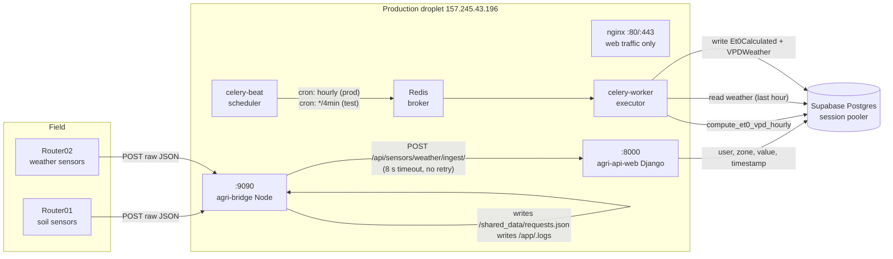
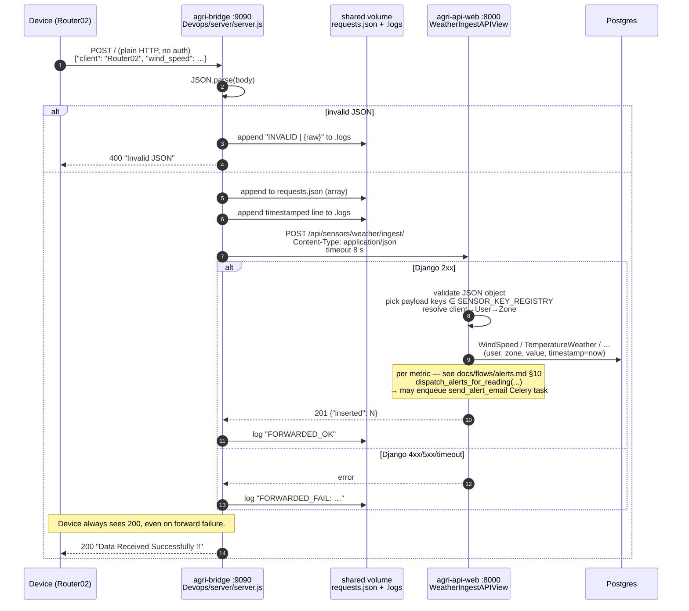
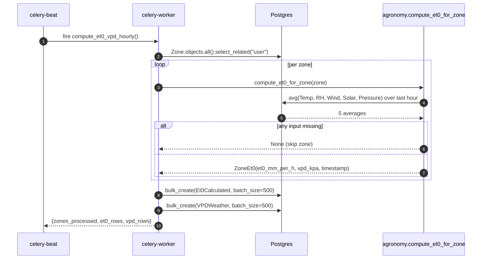

# Data Ingestion — End-to-End Flow

How a sensor reading travels from a field device into the database, and
how it is later turned into derived series (ET0, VPD) by the periodic
Celery jobs. Last verified 2026-05-20.

## TL;DR

```
Device (Router0X)  →  agri-bridge:9090 (Node)  →  agri-api-web:8000 (Django)  →  Postgres
                              │                              │
                              │ archive                       │ periodic
                              ▼                              ▼
                       /shared_data/                    Celery beat → worker
                       requests.json                    compute_et0_vpd_hourly()
                       /app/.logs                       → Et0Calculated + VPDWeather
```

- Devices hit the **Node bridge directly on port 9090** (bypasses nginx).
- Node archives every payload and forwards (best-effort) to Django.
- Django's `WeatherIngestAPIView` is **registry-driven**: any key in
  `analytics/alerts.py:SENSOR_KEY_REGISTRY` that appears in the payload
  with a non-None value lands in its model and fans out to the alert
  dispatcher. Unknown keys are silently dropped. NPK is the one
  intentional exclusion (multi-value model, tracked separately).
  Auth-less.
- Once an hour (prod) the Celery worker recomputes ET0 + VPD per zone
  from the last hour of weather data and writes new rows.

## High-level architecture



## Critical path — a single device POST



## Components in detail

### 1. The device

- Production gateway today is **Router02** (weather sensors only, ~3 sensor
  readings per minute). Router01 (soil sensors) has been silent since
  before the agri-bridge container restart on 2026-05-20.
- The device sends one JSON **object** (not an array) per reading, by
  POST to `http://157.245.43.196:9090/`.
- Payload shape currently in production:
  ```json
  {
    "client": "Router02",
    "wind_speed": 0,
    "pressure_weather": 9306,
    "temperature_weather": 24.8,
    "humidity_weather": 36.5,
    "solar_radiation": 0,
    "wind_direction": 172
  }
  ```
- Historical Router01 payload shape (still archived in `requests.json`,
  not currently arriving):
  ```json
  {
    "client": "Router01",
    "ec_soil_low": 160, "ec_soil_medium": 159,
    "soil_moisture_low": 15.9, "soil_moisture_medium": 16.4,
    "soil_temperature_low": 15.9, "soil_temperature_medium": 16.3
  }
  ```

### 2. The Node bridge — `Devops/server/server.js`

- Listens on `0.0.0.0:9090` — `server.js:108-110`.
- Parses with `JSON.parse(body)` — `server.js:61`.
- **Invalid JSON** → appends `INVALID | <raw>` to `.logs`, returns 400 —
  `server.js:64-66`.
- **Valid JSON**:
  - Appends the whole object to `/shared_data/requests.json` (single
    JSON array, rewritten on every request — see Gotchas below) —
    `server.js:84-85`.
  - Appends `<ISO timestamp> | <status> | <body>` to `/app/.logs` —
    `server.js:100-101`.
  - If the payload is an object (not an array), forwards it via plain
    HTTP to `${PY_HOST}:${PY_PORT}${PY_PATH}` — defaults to
    `agri-api-web:8000/api/sensors/weather/ingest/` — `server.js:9-11, 88`.
  - Forward timeout: **8 seconds**, no retry — `server.js:27`.
- **The device always gets 200** with body `"Data Received Successfully !!"`,
  even if the forward to Django failed (timeout, 4xx, 5xx) —
  `server.js:103-104`. Operationally risky; see Known issues below.

### 3. The Django ingest view — `back/analytics/views.py:WeatherIngestAPIView`

- Route: `back/analytics/urls.py:50` →
  `path("sensors/weather/ingest/", WeatherIngestAPIView.as_view())`.
- **No auth and no permissions** — `authentication_classes = []`,
  `permission_classes = []`.
- Validation chain:
  1. Body must be a JSON **object**, not an array.
  2. The view collects every key in
     `analytics/alerts.py:SENSOR_KEY_REGISTRY` that appears in the
     payload with a non-None value.
  3. If the resulting set is empty → `200 {"inserted": 0, "detail": "all_metrics_none"}`.
  4. `client` field is **required** as soon as any metric is provided.
- Resolution:
  - `CustomUser.objects.filter(username=client).first()`.
  - First zone of that user (lowest id).
  - Returns 400 if user or zone missing.
- Persistence — one loop, one row per known key:
  ```python
  for sensor_key, value in metrics.items():
      model_cls = get_sensor_model(sensor_key)
      model_cls.objects.create(user=user, zone=zone, value=value, timestamp=now)
      dispatch_alerts_for_reading(sensor_key=…, zone=…, user=…, value=…, timestamp=…)
  ```
- Response: `201 {"inserted": N}`.

**Anything outside `SENSOR_KEY_REGISTRY` is silently dropped** — same
behaviour as the legacy `METRIC_KEYS` approach for unknown fields, but
new sensors now come online by adding a registry entry (and a model)
rather than editing the view. `npk` is the one intentional exclusion
(`NpkSensor` has three value fields, tracked separately).

### 4. The auto-generated per-sensor endpoints — `back/analytics/sensor_registry.py`

- `back/analytics/urls.py:63-69` iterates over the registry and creates
  `path("sensors/<name>/", view.as_view())` per sensor model.
- These views are **GET/PATCH only** — read-and-edit, not ingest. They
  share no code with `WeatherIngestAPIView`.
- They are **authenticated** (`IsAuthenticated`) — the device cannot
  reach them today.

### 5. Celery — what runs and when

`back/agriBack/settings.py:195-238` defines two schedule profiles
selected by the `SCHEDULE_MODE` env var:

| Mode  | Task                              | Cron        | Owner file              |
|-------|-----------------------------------|-------------|-------------------------|
| test  | `simulate_sensor_ingest`          | `*/2 min`   | `tasks.py:324-791`      |
| test  | `compute_et0_vpd_hourly`          | `*/4 min`   | `tasks.py:80-121`       |
| test  | `send_periodic_notifications`     | `*/4 min`   | `tasks.py:16-66`        |
| prod  | `simulate_sensor_ingest`          | `*/15 min`  | `tasks.py:324-791`      |
| prod  | `compute_et0_vpd_hourly`          | hourly @ :00 | `tasks.py:80-121`      |
| prod  | `send_periodic_notifications`     | hourly @ :00 | `tasks.py:16-66`       |

Broker + result backend: Redis at `redis://redis:6379/0`
— `settings.py:201-202`.

### 6. `compute_et0_vpd_hourly` — `back/agriBack/tasks.py:80-121`



`compute_et0_for_zone` is **pure** — no DB writes — and lives in
`back/agriBack/agronomy.py:373-434`. It is the single source of truth
for the FAO-56 Penman-Monteith math and is the function the agronomy
expert is expected to evolve. See `docs/flows/notifications.md` for how
the same module also drives the email body.

## Models touched by this flow

| Model                | File:line                       | Filled by                       |
|----------------------|---------------------------------|---------------------------------|
| `WindSpeed`          | `analytics/models.py:342-357`   | ingest view                     |
| `PressureWeather`    | `analytics/models.py:380-399`   | ingest view                     |
| `TemperatureWeather` | `analytics/models.py:422-441`   | ingest view                     |
| `HumidityWeather`    | `analytics/models.py:319-340`   | ingest view                     |
| `SolarRadiation`     | `analytics/models.py:359-378`   | ingest view                     |
| `WindDirection`      | `analytics/models.py:401-420`   | ingest view                     |
| `Et0Calculated`      | `analytics/models.py:238-262`   | `compute_et0_vpd_hourly`        |
| `VPDWeather`         | `analytics/models.py:1304-1320` | `compute_et0_vpd_hourly`        |

All weather/soil sensor rows share the same shape:
`(user FK, zone FK, value Float, timestamp DateTime)`.

## Container topology — `docker-compose.yml`

| Service        | Image                | Port(s)               | Volumes                          |
|----------------|----------------------|-----------------------|----------------------------------|
| `agri-bridge`   | local Node           | `9090:9090`           | `./shared_data:/shared_data:rw`  |
| `agri-api-web`  | local Django         | `8000:8000`           | `./back:/code`, `./shared_data:/shared:rw` |
| `celery-worker`| same Django image    | —                     | same as agri-api-web              |
| `celery-beat`  | same Django image    | —                     | same as agri-api-web              |
| `redis`        | `redis:7-alpine`     | `6379:6379`           | —                                |
| `mailpit`      | `axllent/mailpit`    | `1025:1025`, `8025:8025` | —                             |

All services share the `agro` bridge network.

## Known issues / gotchas

- **Auth-less ingress.** Both `:9090` and `WeatherIngestAPIView` accept
  any payload from anywhere. Spoofing `"client": "<someone-else>"` is
  enough to inject sensor data into another tenant. Mitigation deferred.
- **`requests.json` is rewritten on every request.** `server.js:80-85`
  reads the whole array, appends, and writes it back. At today's traffic
  rate (~3 POSTs/min, file ~3.4 MB) this is fine; at 50× the traffic it
  becomes a bottleneck and a corruption risk.
- **No timestamps in `requests.json`.** Node writes the body verbatim; the
  per-line `.logs` does have timestamps but is local to the container
  and is wiped on container restart. Backfilling lost data later is hard
  (see incident notes in repo).
- **Mount-path mismatch.** `agri-bridge` mounts the volume at
  `/shared_data`; `agri-api-web` and Celery mount the same host directory
  at `/shared`. No code references that path on the Django side today,
  so it is a latent footgun rather than a live bug.
- **Silent forward failure.** A Django 5xx or timeout returns 200 to the
  device; only `/app/.logs` records `FORWARDED_FAIL`. There is no alert.
- **Adding a new sensor.** Add a row in `SENSOR_KEY_REGISTRY` pointing
  at the model, plus a grace period in `settings.py:ALERT_GRACE_PERIODS`
  if you don't want the 30-min default. The ingest view picks it up
  automatically — no view edit needed.
- **`USE_POSTGRES` case-sensitivity** in `back/docker-entrypoint.sh:29`
  uses `"True"`; the rest of the code accepts `"true"`. Lowercase env
  values skip the `wait_for_postgres` step.

## Source files cited

- `Devops/server/server.js`
- `back/analytics/urls.py`
- `back/analytics/views.py`
- `back/analytics/models.py`
- `back/analytics/sensor_registry.py`
- `back/agriBack/agronomy.py`
- `back/agriBack/tasks.py`
- `back/agriBack/settings.py`
- `back/docker-entrypoint.sh`
- `docker-compose.yml`
