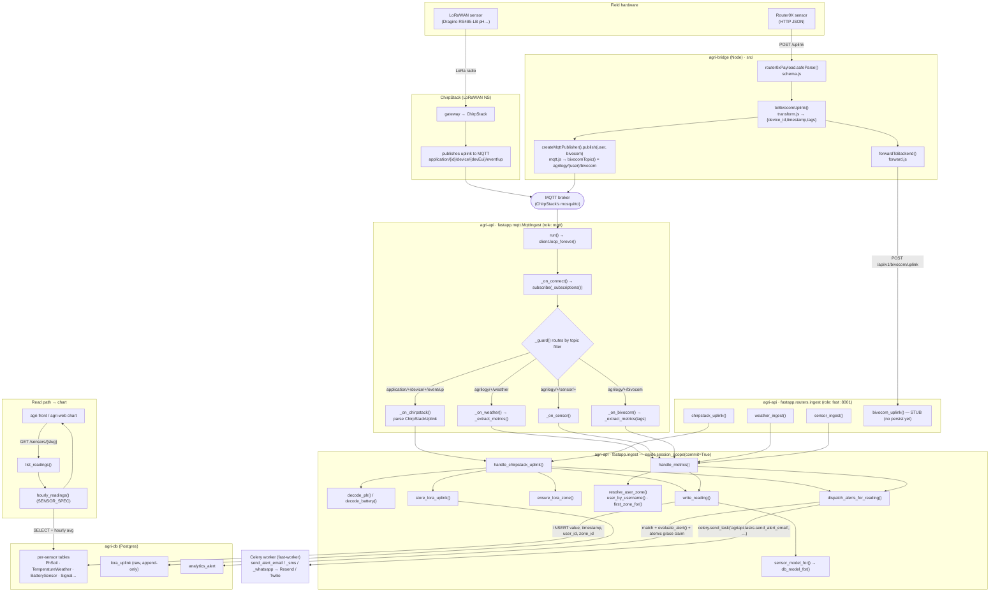
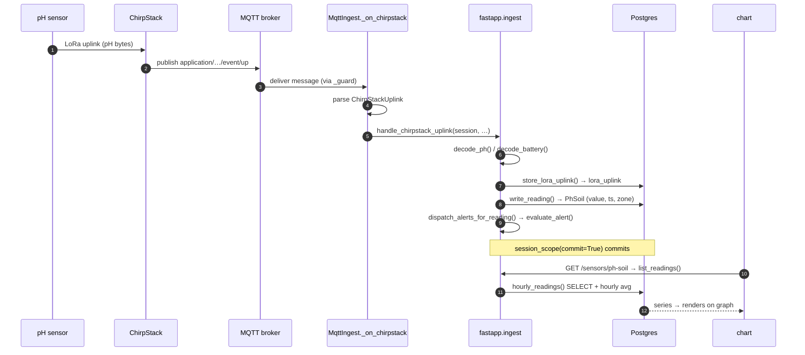

# MQTT Ingest — End-to-End Knowledge

Everything about the MQTT sensor-ingest path: how a reading travels from a
field device over MQTT into Postgres and onto the dashboard graphs, the topic
contract, every function involved, config, deployment, testing, and operations.
Spans two repos — **agri-api** (subscriber + write) and **agri-bridge**
(publisher). Last verified 2026-07-09 (agri-api @ v1.108.1, PRs #371/#374/#375;
agri-bridge #9).

## TL;DR

- MQTT is a **second ingest transport**, added alongside the existing HTTP
  webhooks — **additive, not a replacement**. Rollback = stop the subscriber.
- **One subscriber process** (`fastapp.mqtt.MqttIngest`, entrypoint role `mqtt`,
  container `agri-api-mqtt`) consumes four topic families and writes through the
  **same** `fastapp.ingest` handlers the HTTP path uses — identical rows +
  identical alert enqueues, regardless of transport.
- Broker = **ChirpStack's own MQTT broker** (LoRaWAN uplinks land there
  natively). Generic + Bivocom devices publish to the same broker.
- **agri-bridge** now dual-publishes: HTTP forward (unchanged) **and** MQTT to
  `agrilogy/{user}/bivocom` when `MQTT_URL` is set.
- ⚠️ **Exactly one subscriber replica** — every subscriber receives every
  message, so N replicas = N× writes + N× alerts.

```
LoRaWAN sensor → gateway → ChirpStack ─┐
                                        ├→ MQTT broker → agri-api-mqtt → fastapp.ingest → Postgres → charts
Router0X sensor → agri-bridge (MQTT) ──┘                (MqttIngest)      (handle_*)      (per-sensor)
Router0X sensor → agri-bridge (HTTP) ───────────────→ agri-api :8001 ────┘  (additive; HTTP owns 202/502)
```

## Full flow



## Happy path as a timeline (ChirpStack pH reading)



## Topic + payload contract

Subscribed filters (QoS 1) — `MqttIngest._subscriptions()`
(`back/src/fastapp/mqtt.py:106`):

| Topic filter | Source | Payload (JSON) | Handler |
|---|---|---|---|
| `application/+/device/+/event/up` | ChirpStack v4 | ChirpStack uplink event (`deviceInfo.devEui`, `rxInfo[]`, `fPort`, `object`, `data`) | `handle_chirpstack_uplink()` |
| `agrilogy/+/weather` | generic multi-metric | `{ "<sensor_key>": <float>, … }` (client from topic) | `handle_metrics()` |
| `agrilogy/+/sensor/+` | generic single reading | `{ "value": <float>, "timestamp"?: <iso> }` (client + sensor_key from topic) | `handle_metrics()` |
| `agrilogy/+/bivocom` | Bivocom (bridge-shaped) | `{ "device_id", "timestamp", "tags": { "<sensor_key>": <float> } }` | `handle_metrics()` |

- The **client** (username) is taken from the second topic level
  (`agrilogy/{client}/…`), NOT from the body. The prefix (`agrilogy`) is
  `MQTT_TOPIC_PREFIX`.
- For `sensor`, the **sensor_key** is the fourth topic level and is validated
  against `agri.core.alerts.SENSOR_KEY_REGISTRY` (unknown → dropped).
- For `weather`/`bivocom`, only keys present in `SENSOR_KEY_REGISTRY` (and not in
  `_INGEST_SKIP_KEYS = {"npk"}`) are kept — `_extract_metrics()`
  (`mqtt.py:62`).
- ChirpStack topic is configurable via `MQTT_CHIRPSTACK_TOPIC`.

## Components in detail

### 1. agri-bridge — MQTT publisher (`../agri-bridge/src/`)

- `createMqttPublisher(cfg, logger)` — `mqtt.js:55`. Uses MQTT.js. Returns a
  **no-op** publisher when `MQTT_URL` is unset (bridge stays HTTP-only). Skips
  users containing MQTT metacharacters `/ + #`.
- `bivocomTopic(prefix, user)` — `mqtt.js:35` → `${prefix}/${user}/bivocom`.
- Dual-publish wiring — `server.js:90`: `pub.publish(parsed.data.user, bivocom)`
  runs alongside `forwardToBackend()`; **fire-and-forget, never awaited, never
  affects the HTTP 202/502**.
- Config — `config.js:38-42`: `MQTT_URL`, `MQTT_USERNAME`, `MQTT_PASSWORD`,
  `MQTT_TOPIC_PREFIX` (default `agrilogy`), `MQTT_QOS` (default 1).
- The published body is the **same** `{device_id, timestamp, tags}` object
  `toBivocomUplink()` builds for the HTTP path — the two channels are
  interchangeable. Note the bridge's tag keys are already canonical
  `sensor_key`s (Router0X sends `{user, <sensor_key>: value}`).

### 2. ChirpStack (native MQTT)

- ChirpStack v4 publishes every uplink to its integrated MQTT broker at
  `application/{applicationId}/device/{devEui}/event/up`. **No device or
  ChirpStack code change** — subscribing there is the native LoRaWAN path.
- The uplink `object` is whatever the device codec decoded. The RS485-LB pH
  probe is decoded by `decode_ph()` / `decode_battery()` (codec field first,
  then raw modbus bytes).

### 3. The subscriber — `back/src/fastapp/mqtt.py`

- `MqttIngest` class — `mqtt.py:72`. `run()` (`:267`) → `connect_async()` +
  `client.loop_forever(retry_first_connection=True)` — auto-reconnects from the
  first attempt, so a broker that isn't up yet never crashes the process.
- `_configure()` (`:85`) sets creds/TLS, reconnect backoff (1–60 s), and
  registers a **per-filter callback** (`message_callback_add`) so routing is
  exact — no manual topic parsing.
- `_on_connect()` (`:118`) (re)subscribes on every (re)connect.
- `_guard(kind, topic, fn)` (`:142`) wraps every handler: an `IngestError` is
  logged as rejected, any other exception is logged — the message is **dropped,
  never crashing the loop and never NAKing into a redelivery storm**.
- Per-topic callbacks: `_on_chirpstack()` (`:155`), `_on_weather()` (`:180`),
  `_on_sensor()` (`:203`), `_on_bivocom()` (`:232`). Each parses its body and
  calls the shared handler inside `session_scope(commit=True)`.

### 4. Shared ingest core — `back/src/fastapp/ingest.py`

Transport-agnostic — called by BOTH the MQTT subscriber and the HTTP router
(extracted in PR #370 so the two share one code path).

- `handle_chirpstack_uplink()` (`:549`): `decode_ph()` (`:155`) /
  `decode_battery()` (`:177`) → `store_lora_uplink()` (`:290`) appends the raw
  frame to `lora_uplink` → for each present metric (pH/battery/signal)
  `ensure_lora_zone()` (`:209`) + `write_reading()` (`:273`) +
  `dispatch_alerts_for_reading()` (`:330`). Every LoRaWAN reading is grouped
  under the dedicated `lora` zone/user.
- `handle_metrics()` (`:503`): `resolve_user_zone()` (`:489`) →
  `user_by_username()` + `first_zone_for()`; then per `{sensor_key: value}`,
  `write_reading()` + `dispatch_alerts_for_reading()`. Shared by
  weather/sensor/bivocom.
- `write_reading()` resolves the target ORM model via `sensor_model_for()`
  (`:267`) → `agri.core.alerts.db_model_for()`, then INSERTs
  `(user_id, zone_id, value, timestamp)`.
- `dispatch_alerts_for_reading()` matches `analytics_alert` rows (user-wide,
  farm-zone, and custom notification zones), runs `evaluate_alert()`, makes an
  **atomic conditional grace claim** (a burst can't double-send), and enqueues
  `agriapi.tasks.send_alert_email` / `_digest_email` / `_sms` / `_whatsapp` via
  `fastapp.celery.send_task()` (`celery.py:36`).
- `parse_timestamp()` (`:97`): best-effort ISO parse for the untyped MQTT body
  timestamp (`Z` allowed); malformed → `None` (caller falls back to now).
- `IngestError`: raised for unknown client / no zone / unknown sensor_key; the
  HTTP router maps it to the same `{error}` + status the old inline code
  returned; the MQTT subscriber logs + drops.

### 5. HTTP webhooks (additive) — `back/src/fastapp/routers/ingest.py`

The pre-existing transport; still live. `chirpstack_uplink()` (`:112`),
`weather_ingest()` (`:139`), `sensor_ingest()` (`:189`) are thin shells over the
same `handle_*`. `bivocom_uplink()` (`:57`) is a **stub** (validate + 202, no
persist) — which is why running the bridge's HTTP + MQTT channels together does
**not** double-persist today.

### 6. Read path → graphs — `back/src/fastapp/routers/sensors.py`

- `GET /sensors/{slug}` → `list_readings()` (`:58`) → `hourly_readings()`
  (`back/src/fastapp/sensors.py:368`), using the static `SENSOR_SPEC`. Returns
  hourly-averaged series (`raw=true` for native cadence). `GET /sensors` →
  `list_sensor_catalog()` (`:43`) from `SENSOR_KEY_REGISTRY`. The frontend chart
  polls these — the same rows `write_reading()` inserted are what render.

## Configuration

### agri-api subscriber (`back/.env`) — `back/src/fastapp/settings.py:135-146`

| Var | Default | Purpose |
|---|---|---|
| `MQTT_HOST` | `mosquitto` | Broker host. **Empty ⇒ subscriber idles** (`mqtt_enabled`). Droplet → ChirpStack's broker. |
| `MQTT_PORT` | `1883` | Broker port |
| `MQTT_USERNAME` / `MQTT_PASSWORD` | `""` | Broker auth |
| `MQTT_TLS` | `false` | TLS to the broker (system CA store) |
| `MQTT_CLIENT_ID` | `agri-api-ingest` | Client id |
| `MQTT_QOS` | `1` | Subscribe QoS |
| `MQTT_TOPIC_PREFIX` | `agrilogy` | Generic/Bivocom topic prefix |
| `MQTT_CHIRPSTACK_TOPIC` | `application/+/device/+/event/up` | ChirpStack uplink filter |
| `MQTT_HEALTH_FILE` | `/tmp/mqtt-healthy` | Liveness file kept fresh only while CONNECTED; the container healthcheck stats it |
| `MQTT_HEALTH_INTERVAL` | `15` | Seconds between heartbeat re-touches of that file |

⚠️ `MQTT_HOST` / `MQTT_PORT` are also set on the service by `docker-compose.yml`
(`environment:`), which **overrides** `back/.env` — on a deployed host the
effective value lives in the compose-project `.env` (e.g. `/root/agri-api/.env`).

### agri-bridge publisher — `../agri-bridge/src/config.js`

| Var | Default | Purpose |
|---|---|---|
| `MQTT_URL` | _(unset)_ | Broker URL (e.g. `mqtt://mosquitto:1883`). **Unset ⇒ MQTT disabled** (HTTP only). |
| `MQTT_USERNAME` / `MQTT_PASSWORD` | _(unset)_ | Broker auth |
| `MQTT_TOPIC_PREFIX` | `agrilogy` | Publish topic `{prefix}/{user}/bivocom` |
| `MQTT_QOS` | `1` | Publish QoS |

## Deployment topology

- **Entrypoint role `mqtt`** — `back/docker-entrypoint.sh:175`: waits for
  Postgres + Redis, then `exec python -m fastapp.mqtt`.
- **Compose service `agri-api-mqtt`** — `docker-compose.yml:227`: same image/env
  as the FastAPI sidecar, `command … mqtt`, depends on `agri-api-web` +
  `redis`. `MQTT_HOST` defaults to the dev `mosquitto` service
  (`docker-compose.yml:46`) and is overridden by the compose-project `.env` on
  the droplet.
- **Broker route (prod)** — `agri-api-mqtt` joins ChirpStack's own compose
  network (`networks: [agro, chirpstack]`, external, name from
  `CHIRPSTACK_NETWORK`, default `chirpstack_default`) and addresses the broker by
  **container name** (e.g. `chirpstack-mosquitto-1`). Do **not** use the docker
  bridge gateway IP (`172.18.0.1`): that route leaves the container to the host,
  so it is filtered by the host INPUT chain — enabling UFW (policy DROP)
  blackholed it, the socket stayed in `SYN_SENT`, `mqtt.connected` was never
  logged, and LoRa ingest stopped.
- **Healthcheck** — the container reports healthy **only while the subscriber is
  connected**: `fastapp.mqtt` writes `MQTT_HEALTH_FILE` on CONNACK, re-touches it
  every `MQTT_HEALTH_INTERVAL` seconds while `is_connected()`, and deletes it on
  disconnect; the healthcheck fails if the file is missing or older than 60s.
  Before this, a never-connected subscriber still showed `Up (healthy)`.
- Needs Postgres (readings + grace claim) and Redis (alert-task enqueue via
  `send_task`).
- ⚠️ **Never scale `agri-api-mqtt` past 1 replica** — every subscriber gets
  every message.

## Activation runbook (production)

MQTT is merged but **dormant** until wired to a broker:

1. **agri-api:** confirm ChirpStack's network + broker container names on the
   host (`docker network ls | grep -i chirpstack`,
   `docker ps --format '{{.Names}}' | grep -i mosquitto`), set
   `CHIRPSTACK_NETWORK` (only if it is not `chirpstack_default`) and
   `MQTT_HOST=<broker container name>` (+ `MQTT_USERNAME`/`MQTT_PASSWORD`/
   `MQTT_TLS`) in the compose-project `.env` next to `docker-compose.yml`.
   Deploy → the container joins that network and starts consuming.
2. **agri-bridge:** set `MQTT_URL` (+ creds) → the same broker in the bridge
   container env. It then dual-publishes Bivocom uplinks.
3. **Avoid double-delivery for ChirpStack:** if you point the subscriber at the
   ChirpStack topic, **disable ChirpStack's HTTP integration** for that
   application, or the same uplink arrives twice (HTTP webhook + MQTT). (Today
   the Bivocom HTTP endpoint is a no-op stub, so the bridge's dual channels are
   safe; the ChirpStack HTTP webhook is NOT a stub — it persists.)
4. Verify: publish a test message and confirm rows land + a chart updates.

## Testing & CI

- **Unit** — `back/src/fastapp/tests/test_mqtt_ingest.py`: topic→handler routing
  + parsing, paho mocked (no broker/DB). Runs everywhere.
- **Broker** — `test_mqtt_broker.py`: a real `mosquitto` (fixture launches a
  throwaway one on an ephemeral port), real publish → subscriber thread →
  handler recorded (no DB). Proves the socket plumbing.
- **E2E** — `test_mqtt_e2e.py`: real broker + real Postgres + unmocked handlers;
  asserts DB rows + alert enqueues for every case (chirpstack data/status,
  weather, single sensor, alert dispatch, bivocom, unknown user/key, malformed).
  Negative cases use a trailing **sentinel** so "no row" is deterministic.
- Shared fixtures — `back/src/fastapp/tests/conftest.py`: `mqtt_broker`,
  `mqtt_subscriber`, `mqtt_publish`, `wait_until`. Skip when `mosquitto` is
  absent — unless `MQTT_REQUIRE_BROKER=1` (CI), which turns a missing broker
  into a **failure** so the gate can't silently no-op.
- **CI gate** — `.github/workflows/primary.yml` job `mqtt-e2e`: Postgres 16
  service + `apt-get install mosquitto`, runs the broker + e2e files on every
  PR/push. (The shared `test` job runs the whole suite; the broker/e2e tests
  skip there since it has no mosquitto.)
- **agri-bridge** — `../agri-bridge/tests/mqtt.test.js` (unit) +
  `tests/mqtt.e2e.test.js` (real in-process `aedes` broker: publish round-trip,
  unsafe-user skip, `POST /uplink` fans out to HTTP + MQTT).

## Operational notes / gotchas

- **Additive + best-effort.** MQTT never changes the HTTP contract. The bridge's
  publish is fire-and-forget (MQTT.js queues through broker blips). The
  subscriber drops bad messages via `_guard()`. Rollback = stop `agri-api-mqtt`.
- **Single subscriber only** (bears repeating): N replicas ⇒ N× writes/alerts.
- **`lora_uplink` is unmanaged** — Django's `TransactionTestCase` never
  truncates it, so tests must scope assertions by a unique `devEui` (rows
  accumulate across the session). Same convention as `test_ingest_parity`.
- **`ensure_lora_zone` sets `notify_every`/`preferred_language` explicitly**
  (PR #374): the agri.db schema has server defaults but a Django-migration DB
  doesn't, so the first MQTT-path `lora` provisioning would `NotNullViolation`
  otherwise.
- **`amqtt` can't be the in-process test broker** — it hard-conflicts the pinned
  `click==8.2.1` (celery). Use the real `mosquitto` binary (agri-api) / `aedes`
  (agri-bridge).
- **Local Postgres for the e2e** needs a short socket dir: `pg_ctl … -o "-k
  /tmp"` (the scratchpad path exceeds Postgres's 103-char socket limit).

## Follow-ups (not built)

- **Raw-Modbus-tag Bivocom** via the `analytics_devicesensor` mapping
  (device tag → sensor_key + zone) is deferred: the `00a3976cb808` migration is
  held, the table has no `user_id`, and its `device_id` is an int soft-FK vs the
  string the bridge/payload use. The bridge-shaped path already covers today's
  live Bivocom (its tags are already sensor_keys).
- **Shared-secret auth** on the HTTP webhooks (MQTT uses broker-level auth).

## Source files cited

**agri-api**
- `back/src/fastapp/mqtt.py` — the subscriber (`MqttIngest`)
- `back/src/fastapp/ingest.py` — shared handlers (`handle_*`, `dispatch_*`, `write_reading`, …)
- `back/src/fastapp/routers/ingest.py` — HTTP webhooks (additive)
- `back/src/fastapp/routers/sensors.py` + `back/src/fastapp/sensors.py` — read/graph path
- `back/src/fastapp/settings.py` — `MQTT_*` settings
- `back/src/fastapp/celery.py` — `send_task`
- `back/docker-entrypoint.sh` — `mqtt` role
- `docker-compose.yml` + `deploy/mosquitto/mosquitto.conf` — `agri-api-mqtt` + dev broker
- `back/src/fastapp/tests/{conftest,test_mqtt_ingest,test_mqtt_broker,test_mqtt_e2e}.py`
- `.github/workflows/primary.yml` — `mqtt-e2e` CI job

**agri-bridge**
- `src/mqtt.js` — `createMqttPublisher`, `bivocomTopic`
- `src/server.js` — dual-publish wiring
- `src/config.js` — `MQTT_*` config
- `tests/{mqtt.test,mqtt.e2e.test}.js`
