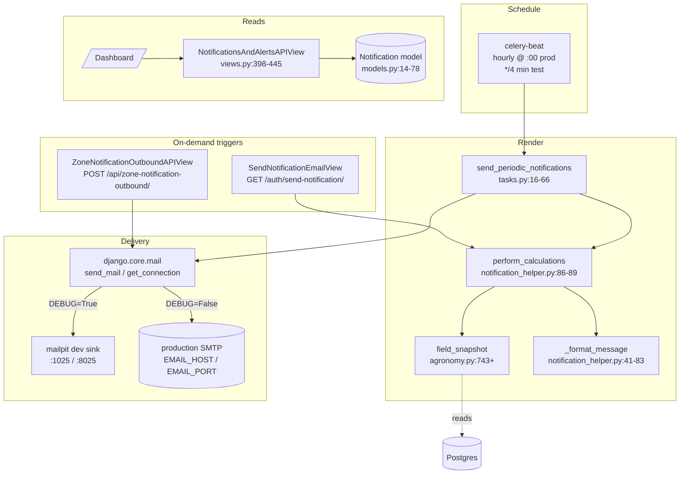

# Notifications — End-to-End Flow

How an email notification is composed, scheduled, sent, and read back by
the frontend. Last verified 2026-05-20.

## TL;DR

```
celery-beat            celery-worker                 send_mail               user inbox
hourly tick   ──▶  send_periodic_notifications()  ──▶  SMTP backend  ──▶  recipient
                          │
                          │ for each active user:
                          │   - skip if no email
                          │   - skip if should_notify() False
                          │   - body = perform_calculations(user)
                          │   - send + bump last_notified
                          ▼
                  agronomy.field_snapshot(user)
                  pulls weather / soil / irrigation from Postgres
```

- One **batch task** runs hourly in production and renders one email per
  eligible user.
- The body text is rendered by `perform_calculations()` from a
  `field_snapshot()` dict — no template file; the format string lives in
  Python.
- A **separate read endpoint** (`/api/notifications-and-alerts/`) feeds
  the dashboard from the `Notification` model — but that model is barely
  written today (only tests create rows). Frontend mostly merges in
  template rows of its own.
- The **on-demand** email-send endpoint (`/auth/send-notification/`) is
  available so the frontend can trigger a one-shot email outside the
  schedule.

## High-level architecture



## Critical path — one scheduled email

```mermaid
sequenceDiagram
  autonumber
  participant Beat as celery-beat
  participant Worker as celery-worker
  participant T as send_periodic_notifications
  participant H as notification_helper
  participant A as agronomy.field_snapshot
  participant PG as Postgres
  participant M as send_mail
  participant Inbox as User inbox

  Beat->>Worker: fire send_periodic_notifications()
  Worker->>T: enter task
  T->>PG: User.objects.filter(is_active=True).iterator(200)
  loop per user
    alt no email
      T-->>T: skipped += 1
    else should_notify(user) == False
      Note over T: gate: elapsed < notify_every (default 4 h)
      T-->>T: skipped += 1
    else
      T->>H: perform_calculations(user)
      H->>A: field_snapshot(user)
      A->>PG: avg/latest sensor reads for user's first zone
      A-->>H: snapshot dict
      H->>H: _format_message(user, snapshot)
      H-->>T: French plaintext body
      T->>M: send_mail(subject, body, from, [user.email], connection)
      alt success
        M->>Inbox: deliver
        T->>PG: user.last_notified = now() ; save
        T-->>T: sent += 1
      else exception
        T-->>T: failed += 1 (does not abort batch)
      end
    end
  end
  T-->>Worker: {sent, skipped, failed}
```

## Components in detail

### 1. The Celery task — `back/agriBack/tasks.py:16-66`

- `@shared_task def send_periodic_notifications()` —
  `tasks.py:16-66`.
- Iterates active users via
  `User.objects.filter(is_active=True).iterator(chunk_size=200)` —
  `tasks.py:32`.
- Per-user error handling is local: any exception increments `failed`
  but the loop continues — `tasks.py:54-58`.
- Final return: `{"sent": int, "skipped": int, "failed": int}` —
  `tasks.py:60-66`.

### 2. The cadence gate — `back/CustomUser/notification_helper.py:24-29`

```python
def should_notify(user) -> bool:
    if not getattr(user, "last_notified", None):
        return True
    elapsed = now() - user.last_notified
    return elapsed.total_seconds() >= getattr(user, "notify_every", 4) * 3600
```

- The user model carries two fields: `last_notified` (datetime) and
  `notify_every` (int hours, default 4).
- This is the **only deduplication** in the path. There is no DB-level
  uniqueness on the `Notification` row.

### 3. The body renderer — `back/CustomUser/notification_helper.py`

- `perform_calculations(user)` → `field_snapshot(user)` → `_format_message(user, snapshot)` →
  plaintext French string — `notification_helper.py:86-89`.
- `_format_message` builds the email inline; no `.html` or `.txt`
  template file. Edits must happen in Python — `notification_helper.py:41-83`.
- Snapshot keys consumed (per `back/agriBack/agronomy.py:743+`):
  - Air: `yesterday_temp_c`, `today_temp_c`, `yesterday_humidity_pct`,
    `today_humidity_pct`.
  - Water budget: `et0_today_mm`, `kc_used`.
  - Soil: `soil_moisture_pct`, `soil_temperature_c`, `soil_ph`,
    `soil_ec`, `soil_salinity`, `npk_n/p/k`.
  - Irrigation: `last_irrigation_at`, `last_irrigation_l`,
    `perfect_irrigation_window`, `irrigation_decision`.
- Only the user’s **first zone** (lowest id) is rendered —
  `agronomy.py:790`. Multi-zone tenants will receive a partial email.

### 4. The email backend — `back/agriBack/settings.py:246-261`

- `DEBUG=True` → console backend (prints to stdout); `mailpit` is also
  available on `:1025` SMTP and `:8025` web UI for local dev.
- `DEBUG=False` → SMTP backend; reads `EMAIL_HOST / EMAIL_PORT /
  EMAIL_HOST_USER / EMAIL_HOST_PASSWORD / EMAIL_USE_TLS` from env.
- Default sender: `"Agrilogy <noreply@agrilogy.local>"` —
  `settings.py:259-261`.
- Subject for the periodic email is hard-coded French at
  `tasks.py:44-45`: `"Mise à jour de votre terrain agricole"`. No i18n.

### 5. The read endpoint — `back/analytics/views.py:398-445`

- Route: `back/analytics/urls.py:52-54` →
  `path("notifications-and-alerts/", NotificationsAndAlertsAPIView.as_view())`.
- Auth: `IsAuthenticated`.
- Query: `Notification.objects.filter(user=request.user).order_by("-notification_date")[:200]`
  — `views.py:410-412`.
- Response shape (note the **hard-coded** `is_read`, `read_at`,
  `zone_name`, `_source` — the model has no read state):
  ```json
  {
    "notifications": [
      {
        "id": 123,
        "is_read": false,
        "read_at": null,
        "zone_name": null,
        "_source": "server",
        "notification": { "yesterday_temperature": "22.50", … }
      }
    ]
  }
  ```
- **Important caveat:** the `Notification` model is currently only
  written by test fixtures (`tests/test_email_notifications.py:68`). The
  production periodic task does NOT persist a `Notification` row when it
  sends an email. So this endpoint is mostly empty against a fresh DB
  and the dashboard supplements it with locally-templated rows.

### 6. The on-demand triggers

#### `GET /auth/send-notification/` — `back/CustomUser/views.py:332-369`

- Re-uses `perform_calculations(user)` and `send_mail()`.
- Auth: `IsAuthenticated`.
- Response: `{"success": bool, "message"|"error": str}`.
- Used by the dashboard when the user clicks "Send me an email now".

#### `POST /api/zone-notification-outbound/` — `back/analytics/views.py:448-495`

- Triggered by the zone-config page when the user toggles
  `channels.email = true` while saving. Sends a one-shot confirmation
  email.
- Payload: `{ zoneId, subject, message, channels, contactEmail? }`.
- Logic — `views.py:459-495`:
  1. If `channels.email` is not true → `202 {"status": "noop"}`.
     Non-email channels (`sms`, `whatsapp`) are accepted but no-op in
     v1.
  2. Recipient = `contactEmail` override or `request.user.email`.
  3. Empty recipient → 400.
  4. `send_mail(...)` with `fail_silently=False`; exception → 500.
  5. Success → `202 {"status": "sent"}`.

### 7. The `Notification` model — `back/analytics/models.py:14-78`

A flat snapshot table with no read state, no zone reference, and no
uniqueness constraints. Fields (decimal precision elided):

| Field                          | Type           | Notes                              |
|--------------------------------|----------------|------------------------------------|
| `yesterday_temperature`        | Decimal        | °C                                 |
| `today_temperature`            | Decimal        | °C                                 |
| `yesterday_humidity`           | Decimal        | %                                  |
| `today_humidity`               | Decimal        | %                                  |
| `ET0`                          | Decimal        | mm/day                             |
| `soil_humidity`                | Decimal        | %                                  |
| `soil_temperature`             | Decimal        | °C                                 |
| `soil_ph`                      | Decimal        |                                    |
| `perfect_irrigation_period`    | CharField(100) | e.g. `"06:00-07:00"`               |
| `last_irrigation_date`         | Date           |                                    |
| `last_start_irrigation_hour`   | Time           |                                    |
| `last_finish_irrigation_hour`  | Time           |                                    |
| `used_water_irrigation`        | Decimal        | L                                  |
| `notification_date`            | DateTime       | `default=datetime.now`             |
| `user`                         | FK(User)       | `related_name="user_notifications"`|

The legacy `NotificationsPerUser` join table was removed in migration
`0037_notification_user_delete_notificationsperuser.py:27`.

A previous `@receiver(post_save, sender=Notification)` is referenced in
a comment at `models.py:269-270` but is no longer wired — there is no
signal handler today.

## Known issues / gaps

- **`Notification` rows are never created by the periodic task.** The
  email is sent and `user.last_notified` is bumped, but nothing is
  written to the table that the dashboard reads. The dashboard
  effectively shows test fixtures only.
- **No DB-level deduplication.** `should_notify()` is the only gate.
  If `last_notified` is reset, the same user can be re-mailed
  immediately.
- **Single-zone tenants only.** `field_snapshot` picks the lowest-id
  zone — TODO(expert) at `agronomy.py:788`.
- **No zone filter in the read API.** `zone_name` is hard-coded `null`
  in the response — `views.py:419`.
- **Hard-coded French subject** at `tasks.py:44-45`.
- **No alert wiring.** Triggered alerts do NOT create notifications nor
  emails — see `docs/flows/alerts.md`.

## Source files cited

- `back/agriBack/tasks.py`
- `back/agriBack/settings.py`
- `back/agriBack/agronomy.py`
- `back/CustomUser/notification_helper.py`
- `back/CustomUser/views.py`
- `back/analytics/urls.py`
- `back/analytics/views.py`
- `back/analytics/models.py`
- `back/analytics/migrations/0037_notification_user_delete_notificationsperuser.py`
- `back/analytics/tests/test_email_notifications.py`
